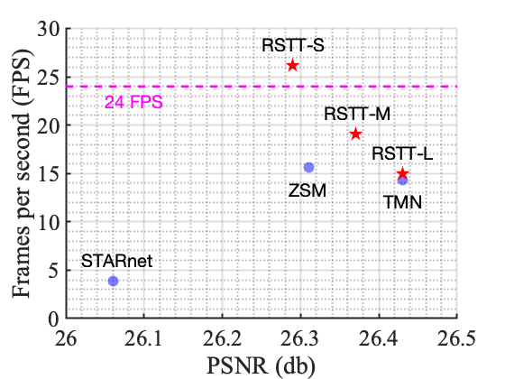
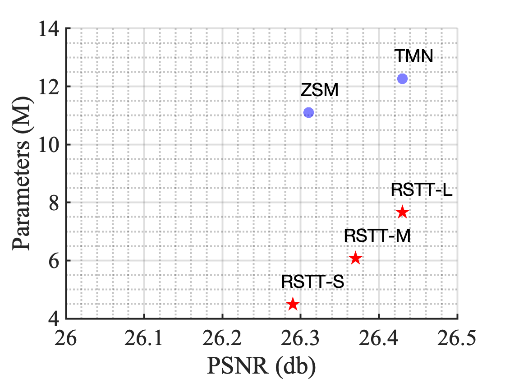
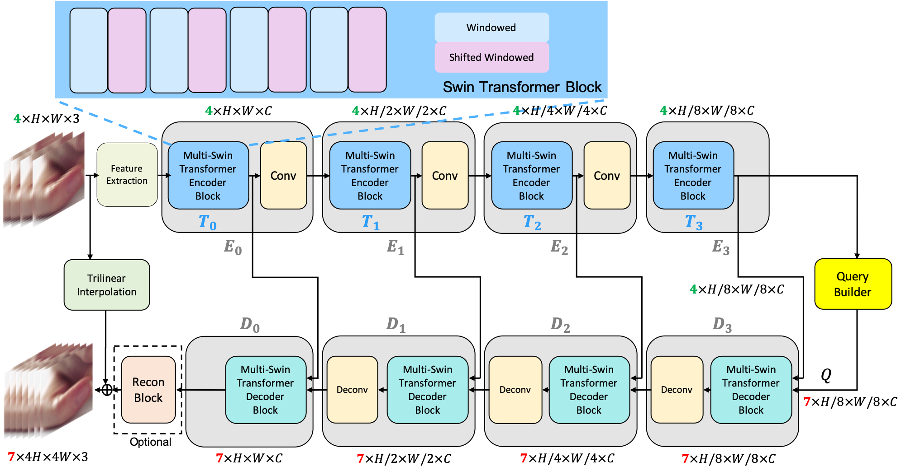

# RSTT (Real-time Spatial Temporal Transformer)
[](https://paperswithcode.com/sota/video-frame-interpolation-on-vid4-4x?p=rstt-real-time-spatial-temporal-transformer)
[](https://paperswithcode.com/sota/space-time-video-super-resolution-on-vimeo90k?p=rstt-real-time-spatial-temporal-transformer)
[](https://paperswithcode.com/sota/space-time-video-super-resolution-on-vimeo90k-1?p=rstt-real-time-spatial-temporal-transformer)

This is the official pytorch implementation of the paper "RSTT: Real-time Spatial Temporal Transformer for Space-Time Video Super-Resolution"

[Zhicheng Geng*](https://zhichenggeng.com/), [Luming Liang*](https://scholar.google.com/citations?user=vTgdAS4AAAAJ&hl=en), [Tianyu Ding](https://www.tianyuding.com) and Ilya Zharkov

IEEE Conference on Computer Vision and Pattern Recognition (**CVPR**), 2022

[Paper](https://arxiv.org/abs/2203.14186) |
[Video](https://www.youtube.com/watch?v=UItUdbLEPHM)

## Introduction
Space-time video super-resolution (STVSR) is the task of interpolating videos with both Low Frame Rate (LFR) and Low Resolution (LR) to produce a High-Frame-Rate (HFR) and also High-Resolution (HR) counterpart. The existing methods based on Convolutional Neural Network (CNN) succeed in achieving visually satisfied results while suffer from slow inference speed due to their heavy architectures. 
We propose to resolve this issue by using a spatial-temporal transformer that naturally incorporates the spatial and temporal super resolution modules into a single model. Unlike CNN-based methods, we do not explicitly use separated building blocks for temporal interpolations and spatial super-resolutions; instead, we only use a single end-to-end transformer architecture. Specifically, a reusable dictionary is built by encoders based on the input LFR and LR frames, which is then utilized in the decoder part to synthesize the HFR and HR frames.

## Performance
Below is performance of RSTT on Vid4 dataset using small (S), medium (M) and large (L) architectures compared to other baseline models. We plot FPS versus PSNR. Note that 24 FPS is the standard cinematic frame rate. We also plot the number of parameters (in millions) versus PSNR. 

<p align="center">
  
  
</p>

## Architecture Overview 
The features extracted from four input LFR and LR frames are processed by encoders Ek, k = 0, 1, 2, 3 to build dictionaries that will be used as inputs for the decoders Dk, k = 0, 1, 2, 3. The query builder generates a vector of queries Q which are then used to synthesize a sequence of seven consecutive HFR and HR frames.

<p align="center">
  
</p>


## Environment
Cuda   11.4

Python 3.8.11

torch  1.9.0


## Installation
```
$ git clone https://github.com/llmpass/RSTT.git
$ pip install -r requirements.txt
```

## Dataset Preparation
Download vimeo90k Septuplet dataset for training and evaluation:

http://toflow.csail.mit.edu/index.html#septuplet

Choose "The original training + test set (82GB)".

```
cp datasets/vimeo_septuplet/*.txt /path/to/vimeo/
```
```
python ./datasets/prepare_vimeo.py --path /path/to/vimeo/
```

Download Vid4 dataset for evaluation:

https://drive.google.com/drive/folders/10-gUO6zBeOpWEamrWKCtSkkUFukB9W5m

## Train
Make sure writing a yml file with settings pointing to correct paths, for example:
```
python train.py --config ./configs/RSTT-S.yml
```

## Evaluation
### Vid4:
Make sure writing a yml file with settings pointing to correct paths, for example:
```
python eval_vid4.py --config ./configs/RSTT-S-eval-vid4.yml
```
### Vimeo90k:
Make sure writing a yml file with settings pointing to correct paths, for example:
```
python eval_vimeo90k.py --config ./configs/RSTT-S-eval-vimeo90k.yml
```

## Citation
~~~
@article{geng2022rstt,
  title={RSTT: Real-time Spatial Temporal Transformer for Space-Time Video Super-Resolution},
  author={Zhicheng Geng and Luming Liang and Tianyu Ding and Ilya Zharkov},
  journal={arXiv preprint arXiv:2203.14186},
  year={2022}
}
~~~
or
~~~
@inproceedings{geng2022rstt,
  title={RSTT: Real-time Spatial Temporal Transformer for Space-Time Video Super-Resolution},
  author={Zhicheng Geng and Luming Liang and Tianyu Ding and Ilya Zharkov},
  booktitle={Proceedings of the IEEE/CVF Conference on Computer Vision and Pattern Recognition},
  pages={?--?},
  year={2022}
}
~~~

## Acknowledgment
Our code is built on [Zooming-Slow-Mo](https://github.com/Mukosame/Zooming-Slow-Mo-CVPR-2020), [EDVR](https://github.com/xinntao/EDVR), [UFormer](https://github.com/ZhendongWang6/Uformer), and [Swin-Transformer](https://github.com/microsoft/Swin-Transformer). We thank the authors for sharing their codes.
